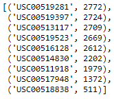

# Surf's Up!

## Purpose
This project is to analyze weather data in Oahu, Hawaii from an SQLite database to try and get investors to invest in a surf board and ice cream shop called Surf's Up!.  The analysis will be used to show investors weather trends in Oahu so they can see how the weather will effect the success of the surfing and ice cream shop.  Specifically the investors want to see the following data:

 - Total precipitation each day for the latest year.
 - Number of stations collecting data.
 - Most active stations.
 - Low, High and Average temperatures for the most active station.
 - Histogram of temperature observations for the most active station.
 - Temperature data for June in Oahu.
 - Temperature data for December in Oahu.
 
## Resources
Data: hawaii.sqlite<br/>
Software: Python 3.8, Jupyter Notebook (anaconda3), VS Code, Flask

## Analysis
The analysis was completed in four major steps which are outlined below.

1. **Prepare the Python toolkit** - The first step in completing the analysis was to set up the tools, connect to the SQLite database and then create a session to link between Python and the database.  This was done by first importing the dependencies required for the analysis.
   ```py
   # Import dependencies
   from matplotlib import style
   style.use('fivethirtyeight')
   import matplotlib.pyplot as plt    
   import numpy as np
   import pandas as pd
   import datetime as dt
   ```   
   Next, the python SQL toolkit (SQLAlchemy) and Object Relational Mapper (ORM) were imported.
   ```py
   import sqlalchemy
   from sqlalchemy.ext.automap import automap_base
   from sqlalchemy.orm import Session
   from sqlalchemy import create_engine, func
   ```
   With all the necessary tools imported, the next step was to connect to the SQLite database, reflect an existing database into a new model and reflect the tables.  
   ```py
   # Connect to the SQLite database.
   engine = create_engine("sqlite:///hawaii.sqlite")
    
   # reflect an existing database into a new model
   Base = automap_base()

   # reflect the tables
   Base.prepare(engine, reflect=True)
   ```
   The database was then scanned to find all of the available classes and each class was saved as a reference.  
   ```
   # We can view all of the classes that automap found
   Base.classes.keys()

   # Save references to each table
   Measurement = Base.classes.measurement
   Station = Base.classes.station
   ```
   The final step of before looking at the data was to create a session link from Python to the database.
   
2. ***Exploring the data*** - With the toolkit set up, the tables loaded and the database connected to Python, the data could now be queried to find the required deliverables.  The first deliverable was to find the total precipititation for each day for the latest year.  To do this, the variable `prev_year` was set to the last date in the database minus 365 days.  The data was then queried to see the date and precipication data from the Measurement class, filtered by only the dates greater than or equal to the `prev_year` variable.  Adding `.all()` to the query, extracted the results and put them into a list.  The list was then saved to a dataframe with the index set to the `'date'` column.  The dataframe was sorted by the index, putting the list in chronological order, the data was plotted using Matplotlib and then the statistics were shown using `df.describe()`.  See the code and the resulting plot and statistics below.
   ```py
   # Design a query to retrieve the last 12 months of precipitation data and plot the results. 
   #Starting from the last data point in the database. 
   prev_year = dt.date(2017, 8, 23)

   # Calculate the date one year from the last date in data set.
   prev_year = dt.date(2017, 8, 23) - dt.timedelta(days=365)

   # Perform a query to retrieve the data and precipitation scores
   results = session.query(Measurement.date, Measurement.prcp).filter(Measurement.date >=prev_year).all()

   # Save the query results as a Pandas DataFrame and set the index to the date column
   df = pd.DataFrame(results, columns=['date', 'precipitation'])
   df.set_index(df['date'], inplace=True)

   # Sort the dataframe by date
   df = df.sort_index()
   print(df)

   # Use Pandas Plotting with Matplotlib to plot the data
   df.plot(title='Total Precitpitation per Day')
   ```
   | Precipitation Plot | Precipitation Stats |
   |:--:|:--:|
   |||
   
   The next deliverable was to find the number of stations collecting data for the provided database.  This was done by querying the Station class for station data and using the `func.count` SQLAlchemy function to count each data point retreived.  Again, `.all()` was added to extract the data points and add them to a list.  The following script shows the query.  Running it showed that there were 9 active stations.
   ```py 
   # How many stations are available in this dataset?
   session.query(func.count(Station.station)).all()
   ```
   
   The third deliverable was to detemine which station was the most active.  This was done by writing a query to look at the Measurement class for the station and return both the station and the count of each time the station was listed.  The query was then grouped each station and ordered in descending order by the count and each data was extracted to a list using `.all()`.  The query and results are shown below.
   ```py  
   # What are the most active stations?
   # List the stations and the counts in descending order.
   session.query(Measurement.station, func.count(Measurement.station)).\
                 group_by(Measurement.station).order_by(func.count(Measurement.station).desc()).all()
   ```
   
   
   The fourth deliverable was to find the lowest temperature recorded, higheste temperature recorded and the average temperature at the most active station.  This was done using the `fuc.min`, `func.max`, and `func.avg` SQLAlchemy functions.  The query was written to return the minimum, maximum and average temperature observation (tobs) from the Measurement class and filter the data for only the 'USC00419281' station, which was found to be the most active.  The results of the query below give the output [(54.0, 85.0, 71.66378066378067)] with the first number being the low, the second the high and the third the average temperature.
   ```py
   # Using the station id from the previous query, calculate the lowest temperature recorded, 
   # highest temperature recorded, and average temperature most active station?
   session.query(func.min(Measurement.tobs), func.max(Measurement.tobs), func.avg(Measurement.tobs)).\
              filter(Measurement.station == 'USC00519281').all()
   ```
   
   
## Results
The June and December temperature query results are shown below along with an explanation of three key differentces between the data for each month.

   | June Temperatures | December Temperatures |
   |:--:|:--:|
   |||

 1. **Average Temperature** - The average temperature in June (74.9°F) is 4° warmer than the average in December (71.0°F).  While there does appear to be a recorded drop in temperature for December,  it doesn't appear to be a large enough drop to deter people from surfing and eating ice cream.  Based on the average temperatures, it appears the shop could be sustainable year-round but to be more informed, a study would need to be done to determine the ideal surfing and ice cream eating temperatures for customers.
 
 2. **High Temperature** - The high temperature in June (85°F) is 2° warmer than the high temperature in December (83°F).  The similarity in these values suggests that the weather doesn't change significantly in Oahu between June and December.  Again, based on the high temperatures, it appears the shop could be sustainable year-round.
 
 3. **Low Temperature** - The low temperature in June (64°F) is 8° warmer that the low temperature in December (56°F).  The low temperatures for December may be enough to deter customers from surfing or eating ice cream, but again, a second study would need to be done to determine the ideal surfing and ice cream eating temperatures for customers.  Also, although the low temperatures could be a cause for concern, the average temperature for December suggests that cold days below 60°F are rare.

## Summary
The results of the analysis show that Surf's Up! surf and ice cream shop could be a sustainable year-round business in Oahu in regards to temperature.  The data shows that Oahu in June has an average temperature of 75°F with a high of 85°F and a low of 64°F.  The temperature in December is slightly cooler with an average of 71°F, a high of 83°F and a low of 56°F.  Although the low for December is quite a bit colder than June, the average December temperature is only 4° cooler and still likely to be within ideal surfing and ice cream eating temperatures for customers.

To look a bit deeper into the sustainability of the shop year-round, a study could be done asking customers what temperatures they prefer for surfing and eating ice cream.  It would also be smart to compare the precipitation in June versus that in December.  Since people don't typically surf or eat ice cream as much if it's raining, precipitation could play an important part in the success of the shop as well.  The two additional queries for the low, high and average precipitation in June and the low, high and average precipitation in December are shown below.  

   | June Precipitation | December Precipitation |
   |:--:|:--:|
   |||

The tables show that the average precipitation is slightly higher in December (0.22") than in June (0.14") and that December had a higher maximum precipitation (6.42") than the max in June (4.43").  The additional rainfall may have a negative effect on sales and year-round sustainability.  Another query to better understand the rain patterns would be to look at how many days out of the each month had precipitation.  This could provide valuable information for how often sales could be impacted by rain.
